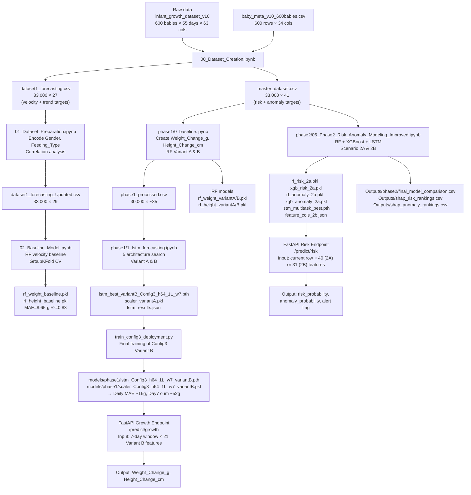

# Growth Component — End-to-End Overview
**Infant Growth Monitoring System (IGMS)**
_Generated: 2026-05-02 | Source: `D:\Research\IGMSAPP\IGMSAPP\notebooks`_

---

## Table of Contents
1. [File Inventory](#1-file-inventory)
2. [Notebook Deep-Dives](#2-notebook-deep-dives)
   - [00_Dataset_Creation.ipynb](#21-00_dataset_creationipynb)
   - [eda.ipynb](#22-edaipynb)
   - [01_Dataset_Preparation.ipynb](#23-01_dataset_preparationipynb)
   - [phase1/0_baseline.ipynb](#24-phase10_baselineipynb)
   - [02_Baseline_Model.ipynb](#25-02_baseline_modelipynb)
   - [03_lstm_prediction.ipynb](#26-03_lstm_predictionipynb)
   - [04_lstm_final.ipynb](#27-04_lstm_finalipynb)
   - [phase1/1_lstm_forecasting.ipynb](#28-phase11_lstm_forecastingipynb)
   - [05_Risk_Prediction_Model2.ipynb](#29-05_risk_prediction_model2ipynb)
   - [phase2/06_Phase2_Risk_Anomaly_Modeling_Improved.ipynb](#210-phase206_phase2_risk_anomaly_modeling_improvedipynb)
   - [lstm_infant_growth_prediction.ipynb](#211-lstm_infant_growth_predictionipynb)
3. [CSV Deep-Dives](#3-csv-deep-dives)
4. [Model Registry](#4-model-registry)
5. [End-to-End Pipeline Diagram](#5-end-to-end-pipeline-diagram)
6. [Integration Contract (FastAPI)](#6-integration-contract-fastapi)
7. [Reproduction Checklist](#7-reproduction-checklist)
8. [Port-to-mlModels Checklist](#8-port-to-mlmodels-checklist)
9. [Open Questions / Gaps](#9-open-questions--gaps)
10. [New folder/ — Duplicate Check](#10-new-folder--duplicate-check)

---

## 1. File Inventory

### Notebooks (`.ipynb`)

| Path | Size | Purpose |
|------|------|---------|
| `notebooks/00_Dataset_Creation.ipynb` | 13.8 KB | Derives `dataset1_forecasting.csv` (velocity targets) and `master_dataset.csv` (risk targets) from raw generated data |
| `notebooks/01_Dataset_Preparation.ipynb` | 365 KB | Encodes categoricals, computes correlations, produces `dataset1_forecasting_Updated.csv` |
| `notebooks/02_Baseline_Model.ipynb` | 101 KB | Random Forest baseline on velocity prediction (velocity targets, 5-fold GroupKFold) |
| `notebooks/03_lstm_prediction.ipynb` | 333 KB | Five LSTM architecture variants for velocity forecasting; comparison vs RF baseline |
| `notebooks/04_lstm_final.ipynb` | 1.1 MB | Definitive LSTM analysis: SHAP, permutation importance, RF vs LSTM feature-importance comparison, horizon evaluation |
| `notebooks/05_Risk_Prediction_Model2.ipynb` | 936 KB | Phase 2 risk/anomaly classification: RF, XGBoost, multitask LSTM; SHAP stability analysis |
| `notebooks/eda.ipynb` | 9.9 KB | Exploratory statistics on raw dataset; key base-rate / conditional probability analysis |
| `notebooks/lstm_infant_growth_prediction.ipynb` | 525 KB | Standalone LSTM experiment predicting absolute Weight (kg) and Height (cm) — **failed clinical threshold** |
| `notebooks/phase1/0_baseline.ipynb` | 139 KB | Phase 1 RF baseline with Variant A (24 feats) and Variant B (21 feats); clinical regime analysis |
| `notebooks/phase1/1_lstm_forecasting.ipynb` | 621 KB | Phase 1 architecture search across 5 LSTM configs; trains all Variant A and Variant B models |
| `notebooks/phase2/06_Phase2_Risk_Anomaly_Modeling_Improved.ipynb` | 940 KB | Improved Phase 2 risk/anomaly models; produces the `_2a`-suffix saved model files |
| `notebooks/New folder/06_Phase2_Risk_Anomaly_Modeling_Improved.ipynb` | 936 KB | Duplicate of phase2 notebook |
| `notebooks/New folder/0_baseline.ipynb` | 139 KB | Duplicate of phase1/0_baseline.ipynb |
| `notebooks/New folder/1_lstm_forecasting.ipynb` | 622 KB | Duplicate of phase1/1_lstm_forecasting.ipynb |

### Python Scripts

| Path | Size | Purpose |
|------|------|---------|
| `notebooks/generate_model_summary.py` | 31.8 KB | Reads JSON/CSV result files, writes `MODEL_SUMMARY_REPORT.txt` |
| `notebooks/generate_early_warning_plots.py` | 14.3 KB | Generates per-baby WAZ + risk-probability timeline plots |
| `notebooks/train_config3_deployment.py` | 16.8 KB | Standalone training script for LSTM Config3 Variant B; saves model + scaler to `models/phase1/` |

### Text / Config Files

| Path | Size | Purpose |
|------|------|---------|
| `notebooks/plan.txt` | 2.0 KB | 4-phase project roadmap |
| `notebooks/MODEL_SUMMARY_REPORT.txt` | 15.7 KB | Full deployment-decision report with all Phase 1 and Phase 2 metrics |
| `notebooks/New folder/lstm_learning_notes.txt` | 13.4 KB | Architecture design notes; 5 identified mistakes in older LSTM approach |
| `notebooks/phase1/lstm_learning_notes.txt` | 13.4 KB | Identical to above |

### Saved Model Files

| Path | Size | Framework | Predicts |
|------|------|-----------|---------|
| `notebooks/Models/lstm_multitask_best.pth` | 57.9 KB | PyTorch | Risk_Next7Days + Anomaly_Flag (multitask classification) |
| `notebooks/Models/rf_anomaly_2a.pkl` | 5.3 MB | scikit-learn | Anomaly_Flag (binary classification) |
| `notebooks/Models/rf_risk_2a.pkl` | 5.3 MB | scikit-learn | Risk_Next7Days (binary classification) |
| `notebooks/Models/xgb_anomaly_2a.pkl` | 748 KB | XGBoost | Anomaly_Flag (binary classification) |
| `notebooks/Models/xgb_risk_2a.pkl` | 660 KB | XGBoost | Risk_Next7Days (binary classification) |

> These are **mirrors** of the canonical models under `models/` at the repo root (see §4).

### Output Files (`Outputs/`)

| Path | Size | Content |
|------|------|---------|
| `Outputs/calibration_curves.png` | 131 KB | Calibration curves for Phase 2 models |
| `Outputs/confusion_matrices.png` | 131 KB | Confusion matrices for Phase 2 classifiers |
| `Outputs/false_alarm_distribution.png` | 56 KB | Per-baby false alert count distribution |
| `Outputs/lead_time_distribution.png` | 63 KB | Days of advance warning distribution |
| `Outputs/phase2_model_comparison.csv` | 773 B | Full Phase 2 metrics table (all models × both targets) |
| `Outputs/phase2_summary.json` | 916 B | Dataset splits, target rates, best model per task |
| `Outputs/shap_anomaly_rankings.csv` | 1.5 KB | SHAP feature importance for RF anomaly model (40 features) |
| `Outputs/shap_rf_anomaly.png` | 73 KB | SHAP beeswarm plot for RF anomaly |
| `Outputs/shap_rf_risk.png` | 74 KB | SHAP beeswarm plot for RF risk |
| `Outputs/shap_risk_rankings.csv` | 1.5 KB | SHAP feature importance for RF risk model (40 features) |
| `Outputs/phase2/baby_growth_examples.png` | 574 KB | Multi-panel growth trajectory examples |
| `Outputs/phase2/extended_results_all_models_datasets.csv` | 1.1 KB | AUC/F1/Precision/Recall for all models × 2A/2B scenarios |
| `Outputs/phase2/false_alert_distribution.png` | 169 KB | Phase 2 false alert distribution |
| `Outputs/phase2/false_alert_statistics.csv` | 270 B | RF: 4.74 alerts/baby; XGB: 1.63 alerts/baby |
| `Outputs/phase2/false_alert_summary.csv` | 213 B | Summary stats |
| `Outputs/phase2/final_model_comparison.csv` | 1.3 KB | Primary benchmark table for supervisor review |
| `Outputs/phase2/lead_time_distribution.png` | 152 KB | Advance warning distribution |
| `Outputs/phase2/lead_time_statistics.csv` | 247 B | RF mean 5.9d; XGB mean 9.0d |
| `Outputs/phase2/lead_time_summary.csv` | 202 B | Summary stats |
| `Outputs/phase2/results_summary.csv` | 930 B | Same as final_model_comparison |
| `Outputs/phase2/trigger2_performance.csv` | 256 B | Trigger-2 (risk-without-underweight) detection metrics |
| `Outputs/phase2/trigger2_results.csv` | 234 B | Detailed trigger-2 results |

---

## 2. Notebook Deep-Dives

### 2.1 `00_Dataset_Creation.ipynb`

**Purpose:** Splits the single synthetic source CSV into two purpose-built datasets: one for growth forecasting (Dataset 1) and one for risk/anomaly classification (Dataset 2 = master).

**Source data:**
- `../Data/Generated/infant_growth_dataset_v10_600babies_55days.csv` — 33,000 rows × 63 columns, 600 babies × 55 days
- `../Data/Generated/baby_meta_v10_600babies.csv` — 600 rows × 34 columns

**Cells:**

| Cell | Type | Action | Output |
|------|------|--------|--------|
| 1 | Code | Load `data_full` and `meta` | No output |
| 2 | Code | Copy to `dataset1`, `dataset2` | No output |
| 3 | Code | Drop 39 columns from `dataset1` (removes leaky labels, raw scales, clinical flags, WAZ fields, risk horizons 14/21, illness fields) | No output |
| 4 | Code | Merge `Gestational_Age_Weeks`, `Birth_Weight_g` from meta; sort by Baby_ID, Age_in_Days | No output |
| 5 | Code | Compute velocity: `Weight_Velocity = diff(Weight_Clean_g)` per baby; `Height_Velocity = diff(Height_Clean_cm)`; compute 3-day rolling slope (polyfit) as `Weight_Trend_3day`, `Height_Trend_3day` | No output |
| 6 | Code | Confirm shape and nulls | Shape: **(33000, 27)**, 0 nulls across all 27 columns |
| 7 | Code | Save `dataset1_forecasting.csv` | "Dataset 1 saved successfully." |
| 8 | Code | Print dtypes | Baby_ID: str, Gender: str, Feeding_Type_Daily: str, most numerics: int64 or float64 |
| 9 | Code | Print meta and data_full dtypes | meta: 34 cols; data_full: 65 cols (after merge) |
| 10 | Code | Build `dataset2` (master): drop 14 columns (mostly meta-noise, Risk_Next14Days, Risk_Next21Days); keeps WAZ_Score, Anomaly_Flag, Risk_Next7Days, Has_Illness_Episode | Shape: **(33000, 41)** with 41 columns listed |
| 11 | Code | Save `master_dataset.csv` | "Saved master_dataset.csv — shape: (33000, 41)" |
| 12 | Code | Empty | No output |

**Dataset 1 schema (33,000 × 27):**

| Column | Dtype | Notes |
|--------|-------|-------|
| Baby_ID | str | B001–B600 |
| Age_in_Days | int64 | 1–55 |
| Gender | str | 'M' / 'F' |
| Feeding_Type_Daily | str | 'breastfed' / 'mixed' / 'formula' |
| F_Breast_Formula | int64 | Binary flag |
| F_Solid_Meal | int64 | Binary flag |
| F_Nutritious_Snacks | int64 | Binary flag |
| F_Iron_Rich | int64 | Binary flag |
| F_Animal_Protein | int64 | Binary flag |
| F_Plant_Based | int64 | Binary flag |
| F_Junk_Food | int64 | Binary flag |
| Feeding_Frequency | int64 | Feeds per day |
| Weight_Clean_g | float64 | Cleaned weight in grams |
| Height_Clean_cm | float64 | Cleaned height in cm |
| BMI | float64 | Computed BMI |
| Daily_Calorie_Intake | float64 | kcal/day |
| Sleep_Hours | float64 | Hours/day |
| Calories_Burned | float64 | kcal/day |
| Net_Energy_Balance | float64 | Intake - Burned |
| SES_Level | int64 | Socioeconomic status (ordinal) |
| Maternal_BMI | float64 | |
| Gestational_Age_Weeks | int64 | |
| Birth_Weight_g | int64 | |
| Weight_Velocity | float64 | g/day delta (0 for first day of each baby) |
| Height_Velocity | float64 | cm/day delta |
| Weight_Trend_3day | float64 | 3-day rolling slope of Weight_Clean_g |
| Height_Trend_3day | float64 | 3-day rolling slope of Height_Clean_cm |

**Artifacts produced:**
- `../Data/Processed/dataset1_forecasting.csv` (33,000 × 27)
- `../Data/Processed/master_dataset.csv` (33,000 × 41)

---

### 2.2 `eda.ipynb`

**Purpose:** Quick exploratory audit of the raw dataset (master). Establishes base rates, conditional probabilities, and temporal ordering of key clinical events.

**Source data:** Raw `../Data/Generated/infant_growth_dataset_v10_600babies_55days.csv` + meta.

**Cells and outputs:**

| Cell | Key Output |
|------|-----------|
| 3 | Meta shape: (600, 34); Data shape: (33000, 63); 600 rows/baby (all exactly 55); Missing values: 600 (all in WAZ_Next_Day) |
| 4 | All 600 babies have exactly 55 rows (correct); validation that 54 check returns 600 babies — because data has 55 rows per baby |
| 5 | Drop rows where `WAZ_Next_Day` is null → removes 1 row per baby (last day) |
| 6 | After drop: **(32,400, 63)**; 600 babies; 0 babies without 54 rows |
| 7 | **Underweight rate: 11.27%**; **Severe underweight: 4.54%**; **Risk_Next7Days rate: 14.04%** |
| 8 | P(Risk): **0.1404**; P(Underweight): **0.1127**; P(Risk \| Underweight): **0.9896**; P(Underweight \| Risk): **0.7943**; Risk-but-NOT-underweight (Trigger-2): **2.89%** of rows = **20.57% of all Risk cases** |
| 9 | Corr(Appetite_Factor, WAZ_Score): **0.7881**; Corr(Net_Energy_Balance, Weight_Velocity): **0.5804**; Corr(F_Animal_Protein, Height_Velocity): **-0.0845** |
| 10 | Anomaly_Flag rate: **17.46%**; Babies with ≥1 anomaly: **41.8%** |
| 11 | P(Deviation \| Underweight): **0.3206**; P(Underweight \| Deviation): **0.2070**; Deviation-but-NOT-underweight: **13.84%** |
| 12 | P(Risk \| Deviation): **0.2521**; P(Deviation \| Risk): **0.3134** |
| 13 | Deviation precedes underweight in only **19.05%** of underweight babies — anomaly detection alone is insufficient for early warning |

**Notable observations:**
- 98.96% of underweight days are also predicted as at-risk. The WAZ threshold captures nearly all true risk.
- Only 20.57% of at-risk days are "Trigger-2" (at-risk without yet being underweight) — these are the clinically valuable early-warning cases.
- Appetite factor has the highest correlation with WAZ (0.79) — this variable is **excluded** from model inputs (leakage risk).

---

### 2.3 `01_Dataset_Preparation.ipynb`

**Purpose:** Encodes categorical columns in Dataset 1, computes full correlation matrix, and saves the updated file used by all downstream models.

**Source data:** `../Data/Processed/dataset1_forecasting.csv` (33,000 × 27)

**Cells and outputs:**

| Cell | Action | Output |
|------|--------|--------|
| 2 | Load dataset1 | Shape: **(33000, 27)**, confirms 27 columns |
| 3 | Inspect string columns | Baby_ID: 600 unique ('B001'–'B600'); Gender: 2 ('M','F'); Feeding_Type_Daily: 3 ('breastfed','mixed','formula') |
| 4 | Encode: `Gender` → {M:1, F:0}; `Feeding_Type_Daily` → one-hot (FeedType_breastfed, FeedType_formula, FeedType_mixed, no drop_first) | No output |
| 5 | Correlation with `Weight_Velocity` (top): Weight_Trend_3day **0.8714**, Net_Energy_Balance **0.5806**, Daily_Calorie_Intake **0.4392**, Feeding_Frequency **0.3480** |
| 6 | Correlation with `Height_Velocity` (top): Height_Trend_3day **0.8113**, F_Breast_Formula **0.6103**, Sleep_Hours **0.5625**; (negative) Age_in_Days **-0.6195**, Height_Clean_cm **-0.5586** |
| 7 | Cell 7 output header says "Next_Day_Height_cm" but prints `corr_height` (appears to be a copy-paste label error) |
| 8 | Plot and save `../Outputs/full_correlation_matrix.png` | Display output |
| 9 | Plot target correlation heatmap, save `../Outputs/target_correlation_heatmap.png` | Display output |
| 10 | Save updated file | **"Saved. (33000, 29)"** — 2 additional columns from one-hot encoding |

**Artifacts produced:**
- `../Data/Processed/dataset1_forecasting_Updated.csv` (33,000 × 29) — adds FeedType_breastfed, FeedType_formula, FeedType_mixed

**Key correlation findings:**

| Feature | Corr w/ Weight_Velocity | Corr w/ Height_Velocity |
|---------|------------------------|------------------------|
| Weight_Trend_3day | **+0.8714** | +0.2875 |
| Net_Energy_Balance | +0.5806 | +0.1478 |
| Daily_Calorie_Intake | +0.4392 | -0.1779 |
| Height_Trend_3day | +0.2153 | **+0.8113** |
| F_Breast_Formula | +0.2042 | **+0.6103** |
| Sleep_Hours | +0.0695 | **+0.5625** |
| Age_in_Days | -0.0549 | **-0.6195** |

---

### 2.4 `phase1/0_baseline.ipynb`

**Purpose:** Establishes RF baseline with two feature variants (Variant A: research features, Variant B: app-realistic features). Includes clinical regime error analysis.

**Source data:** `../../Data/Processed/master_dataset.csv` (33,000 × 41)

**Feature variants:**

| Variant | Feature Count | Extra features vs B |
|---------|--------------|---------------------|
| A | 24 | `Feeding_Source_Diversity`, `Feeding_Compliance`, `Daily_Calorie_Intake` |
| B | 21 | — (app-realistic) |

**Variant B features (exact, 21):**
`F_Breast_Formula`, `F_Solid_Meal`, `F_Nutritious_Snacks`, `F_Iron_Rich`, `F_Animal_Protein`, `F_Plant_Based`, `F_Junk_Food`, `Feeding_Frequency`, `Sleep_Hours`, `Age_in_Days`, `Gender`, `Illness_Day`, `SES_Level`, `Maternal_BMI`, `Gestational_Age_Weeks`, `Birth_Weight_g`, `Gestational_Diabetes`, `Maternal_Nutrition_Score`, `FeedType_breastfed`, `FeedType_formula`, `FeedType_mixed`

**Targets:** `Weight_Change_g` (daily delta), `Height_Change_cm` (daily delta)
_Note: target is delta, not absolute value — avoids near-perfect correlation with today's weight._

**Split:** 420/90/90 babies (70/15/15), baby-wise stratified by high-risk flag.

**Naive baselines (weight prediction):**

| Baseline | Daily MAE (g) | Day-3 Cum (g) | Day-7 Cum (g) | Day-14 Cum (g) |
|----------|--------------|--------------|--------------|---------------|
| Zero-change | 22.70 | 59.95 | 129.10 | 237.60 |
| Mean-change (+13g/day) | 17.95 (daily) | 22.59 | 67.89 | 136.03 |

**RF Baseline Results:**

| Variant | Daily MAE (g) | Day-3 Cum (g) | Day-7 Cum (g) | Day-14 Cum (g) | Height MAE (cm) |
|---------|--------------|--------------|--------------|---------------|----------------|
| Variant A | **13.16** | 23.86 | 54.38 | 94.43 | 0.001688 |
| Variant B | **13.72** | 24.81 | 57.25 | 101.38 | 0.001677 |

**RF Top Feature Importance:**

| Variant A Feature | Importance | Variant B Feature | Importance |
|------------------|-----------|------------------|-----------|
| Illness_Day | 50.29% | Illness_Day | 51.23% |
| Feeding_Frequency | 10.47% | Feeding_Frequency | 13.93% |
| Age_in_Days | 10.05% | Age_in_Days | 12.12% |
| Daily_Calorie_Intake | 9.64% | Maternal_BMI | 6.16% |
| Maternal_BMI | 5.50% | Sleep_Hours | 3.83% |

**Clinical regime error analysis (Variant A):**

| Regime | n | MAE (g) | Mean Actual (g) | Mean Predicted (g) |
|--------|---|---------|----------------|-------------------|
| Illness (<-50g) | 155 | **72.67** | -73.41 | -4.17 |
| Mild loss (-50 to 0g) | 1188 | 14.62 | -13.98 | -6.46 |
| Normal (0-20g) | 1839 | 8.91 | 10.62 | 10.31 |
| High gain (20-40g) | 975 | 12.23 | 29.59 | 29.42 |
| Very high (>40g) | 343 | 24.29 | 53.66 | 48.52 |

- Illness days: MAE = 72.7 g (6.4× harder than normal days)
- Normal days: MAE = 11.3 g

**Artifacts produced:**
- `../../Models/rf_weight_variantA.pkl`
- `../../Models/rf_height_variantA.pkl`
- `../../Models/rf_weight_variantB.pkl`
- `../../Models/rf_height_variantB.pkl`
- `../../Models/baseline_results.json`
- `../../Data/Processed/phase1_processed.csv`

---

### 2.5 `02_Baseline_Model.ipynb`

**Purpose:** Earlier RF baseline run on Dataset 1 (velocity targets, not delta targets). Uses 5-fold GroupKFold CV by Baby_ID.

**Source data:** `../Data/Processed/dataset1_forecasting_Updated.csv` (33,000 × 29)

**Key difference from phase1/0_baseline:** This notebook predicts `Weight_Velocity` and `Height_Velocity` (rolling diff = same-as-delta but using different column), whereas `phase1/0_baseline.ipynb` predicts `Weight_Change_g` and `Height_Change_cm`. Both are effectively daily deltas.

**Model config:** `RandomForestRegressor(n_estimators=100, max_depth=15)`, 5-fold GroupKFold

**Results:**

| Metric | Weight | Height |
|--------|--------|--------|
| MAE | **8.65 ± 0.10 g** | **0.0027 ± 0.0000 cm** |
| R² | 0.8318 | 0.7771 |
| Naive MAE | 17.27 g | 0.0105 cm |
| Naive R² | 0.00 | 0.00 |

**Top RF weight feature importance (all 26 features):**

| Feature | Importance |
|---------|-----------|
| Gender | 82.11% ⚠️ |
| Daily_Calorie_Intake | 6.96% |
| BMI | 1.53% |
| SES_Level | 1.35% |
| Height_Clean_cm | 0.84% |
| Weight_Trend_3day | 0.77% |

> ⚠️ Gender dominates (82.11%) despite only −0.0521 point-biserial correlation with the target. This is a known artifact: RF is using Gender as a proxy for baby subgroup separation. LSTM permutation importance correctly ranks Weight_Trend_3day as #1.

**Artifacts produced:**
- `../models/rf_weight_baseline.pkl`
- `../models/rf_height_baseline.pkl`
- `../models/baseline_results.csv`
- `../Outputs/rf_feature_importance.png`

---

### 2.6 `03_lstm_prediction.ipynb`

**Purpose:** First LSTM iteration — 5 architecture variants, comparison vs RF baseline, permutation importance, SHAP.

**Source data:** `../Data/Processed/dataset1_forecasting_Updated.csv` (33,000 × 29)

**Input features (26):** All columns except Baby_ID, Weight_Velocity, Height_Velocity.
**Targets (2):** `Weight_Velocity`, `Height_Velocity`
**Split:** 70/15/15 baby-wise (420/90/90)
**Window:** 7 days, Batch: 32, max 100 epochs, early stopping patience 20
**Optimizer:** Adam, Huber loss (delta configurable)

**Architecture variants tested:**

| Config | Hidden Layers | Delta | Val Loss | Weight MAE | Weight R² |
|--------|--------------|-------|----------|-----------|---------|
| LSTM 64/32, δ=1.0 | 64→32 | 1.0 | 0.13878 | 15.058 g | 0.4468 |
| LSTM 64/32, δ=2.0 | 64→32 | 2.0 | 0.15514 | 15.058 g | 0.4566 |
| LSTM 64/32, clipped | 64→32 | 1.0 | 0.19181 | 14.218 g | 0.2473 |
| LSTM 128/64 (larger) | 128→64 | 1.0 | 0.13966 | 15.076 g | 0.4507 |
| LSTM no-trend | 64/32 | 1.0 | 0.14668 | 15.573 g | 0.3981 |

- **Best:** δ=1.0, MAE 15.058 g (vs RF 8.65 g — LSTM is 74% worse)
- Removing trend features ("no-trend") causes the worst performance

**LSTM permutation importance (weight velocity):**

| Rank | Feature | Δ MAE |
|------|---------|-------|
| 1 | Weight_Trend_3day | +2.9779 g |
| 2 | Height_Trend_3day | +1.2802 g |
| 3 | Daily_Calorie_Intake | +0.8508 g |
| 4 | Feeding_Frequency | +0.4187 g |

**RF vs LSTM feature importance comparison:**
- Spearman ρ = **0.5091** (moderate agreement, p=0.0079)
- Major discrepancy: RF ranks Gender #1 (82.11%), LSTM ranks it #18 (+0.0098 g). LSTM correctly identifies trend features as dominant.

**Training curve behavior:** Early stopping at epoch 84 (best epoch 64, val loss 0.13913).

**Artifacts produced:**
- `../Models/lstm_forecasting_v1.pth`
- `../Outputs/lstm_training_curve.png`
- `../Outputs/lstm_feature_importance.png`
- `../Outputs/feature_importance_comparison.png`

---

### 2.7 `04_lstm_final.ipynb`

**Purpose:** Definitive LSTM analysis on Dataset 1 velocity targets. Includes SHAP with stability test, per-horizon MAE evaluation, and corrected RF comparison.

**Source data:** `../Data/Processed/dataset1_forecasting_Updated.csv`
**Architecture:** 2-layer LSTM (64→32) + BatchNorm + Dense(16), 36,722 parameters
**Split:** (20160, 7, 26) train | (4320, 7, 26) val | (4320, 7, 26) test
**Device:** CUDA

**Training log (selected epochs):**

| Epoch | Train Loss | Val Loss |
|-------|-----------|---------|
| 1 | 0.43153 | 0.17121 |
| 10 | 0.20734 | 0.15125 |
| 30 | 0.17858 | 0.14177 |
| 60 | 0.16940 | 0.13913 ← best |
| 84 | — | Early stop |

Best val loss: **0.13913** at epoch 64.

**Test metrics (final model):**

| Target | MAE | RMSE | R² |
|--------|-----|------|----|
| Weight_Velocity | **15.058 g** | 22.721 g | 0.4468 |
| Height_Velocity | **0.00405 cm** | 0.00508 cm | 0.8260 |

**Per-horizon evaluation (LSTM):**

| Horizon | Weight MAE (g) | Height MAE (cm) | N samples | Within 20g? |
|---------|----------------|----------------|-----------|-------------|
| Day 3 | 14.499 | 0.003974 | 316 | 75.6% ✓ PASS |
| Day 7 | 14.671 | 0.003925 | 632 | 75.0% ✓ PASS |
| Day 14 | 15.186 | 0.004177 | 1,185 | 73.2% ✓ PASS |
| Day 21 | 15.101 | 0.004198 | 1,738 | — |
| Overall | 15.058 | 0.004050 | — | — |

- Weekly (7-day cumulative) threshold check: RF passes at 68.9%, LSTM fails at 32.2%

**SHAP (KernelExplainer, 300 background samples, seed stability):**

Stability test 1 (100 bg): Spearman ρ = 0.3927 ✗ Unstable
Stability test 2 (300 bg): Spearman ρ = **0.4413** ✗ Still flagged unstable by test criterion, but top-5 overlap = 5/5

**Final SHAP rankings (LSTM, weight velocity, 300 bg):**

| Feature | Mean |SHAP| |
|---------|------------|
| Weight_Clean_g | 0.003834 |
| Age_in_Days | 0.003043 |
| Calories_Burned | 0.003031 |
| Has_Illness_Episode | 0.002645 |
| BMI | 0.002127 |

**Corrected RF feature importance (baby-wise split):**

| Feature | Importance |
|---------|-----------|
| Weight_Trend_3day | 82.456% |
| Net_Energy_Balance | 6.837% |
| Daily_Calorie_Intake | 1.812% |
| Height_Trend_3day | 1.256% |
| BMI | 0.754% |

> After correcting the RF train/test split to baby-wise (no temporal leakage), RF correctly ranks Weight_Trend_3day #1 at 82.5%.

**Artifacts produced:**
- `../Models/lstm_forecasting_v1.pth`
- `../Outputs/lstm_training_curve.png`
- `../Outputs/feature_importance_comparison_corrected.png`
- `../Outputs/weekly_error_validation.png`
- `../Outputs/shap_feature_importance.png`

---

### 2.8 `phase1/1_lstm_forecasting.ipynb`

**Purpose:** Definitive Phase 1 LSTM architecture search. Trains all 5 configs × 2 variants (A & B). Results persisted to `models/lstm_results.json`.

**Source data:** `../../Data/Processed/phase1_processed.csv`
**Target:** `Weight_Change_g`, `Height_Change_cm` (delta, not velocity)
**Split:** Same 420/90/90 baby IDs as in `baseline_results.json` — reproducible via SEED=42

**Architecture search results (from `models/lstm_results.json`, validation MAE, weight):**

| Config | Window | Hidden | Layers | Bidirectional | Val MAE Weight (g) | Val MAE Height (cm) | Deployable |
|--------|--------|--------|--------|--------------|--------------------|--------------------|-----------|
| Config1_h64_2L_w7 | 7 | 64 | 2 | No | **15.621** | 0.005221 | ✓ |
| Config2_h128_2L_w14 | 14 | 128 | 2 | No | **15.135** | 0.005415 | ✗ (w=14) |
| Config3_h64_1L_w7 | 7 | 64 | 1 | No | **15.598** | 0.004543 | ✓ ← **DEPLOYED** |
| Config4_BiLSTM_h64_2L_w7 | 7 | 64 | 2 | Yes | **15.602** | 0.005379 | ✓ |
| Config5_h128_2L_w7 | 7 | 128 | 2 | No | **15.737** | 0.004784 | ✓ |

**Architecture selection note:** Config2 (w=14) has the best raw val MAE (15.135 g) but is NOT deployable (requires 14 days history). On the common-subset validation (Age_in_Days ≥ 15), Config3 achieves 15.135 g — identical to Config2 — making Config3 the recommended deployment choice.

**Test results (from `models/lstm_results.json`):**

| Metric | Variant A | Variant B |
|--------|-----------|-----------|
| Daily MAE weight | 15.90 g | 15.97 g |
| Daily RMSE weight | 24.17 g | 24.59 g |
| Daily MAE height | 0.004890 cm | 0.004586 cm |
| Day-3 cumulative weight | 33.44 g | 33.29 g |
| Day-7 cumulative weight | 51.82 g | 52.65 g |
| Day-14 cumulative weight | 87.85 g | 89.50 g |

**LSTM permutation importance (Variant A, from `lstm_results.json`):**

| Rank | Feature | Δ MAE |
|------|---------|-------|
| 1 | Illness_Day | +2.572 g |
| 2 | Daily_Calorie_Intake | +1.764 g |
| 3 | Age_in_Days | +1.052 g |
| 4 | F_Solid_Meal | +0.520 g |
| 5 | Feeding_Source_Diversity | +0.258 g |

**Timestep importance (how much each of the 7 days in window matters):**

| Day in window | Δ MAE |
|--------------|-------|
| t-6 (oldest) | −0.022 |
| t-5 | −0.046 |
| t-4 | −0.076 |
| t-3 | +0.008 |
| t-2 | +0.030 |
| t-1 | +0.210 |
| t (most recent) | **+4.490** |

The most recent day dominates prediction by a wide margin.

**Artifacts produced:**
- `../../models/lstm_best_variantA_Config1_h64_2L_w7.pth` (not in inventory, likely overwritten)
- `../../models/lstm_best_variantA_Config2_h128_2L_w14.pth`
- `../../models/lstm_best_variantA_Config3_h64_1L_w7.pth`
- `../../models/lstm_best_variantB_Config2_h128_2L_w14.pth`
- `../../models/lstm_best_variantB_Config3_h64_1L_w7.pth`
- `../../models/lstm_weight_variantA.pth`
- `../../models/scaler_variantA.pkl`
- `../../models/lstm_results.json`

---

### 2.9 `05_Risk_Prediction_Model2.ipynb`

**Purpose:** Phase 2 classification. Trains RF and LSTM on master_dataset for Risk_Next7Days and Anomaly_Flag. Includes SHAP stability analysis.

**Source data:** `../Data/Processed/master_dataset.csv` (33,000 × 41)

**Target distribution (full dataset):**
- Risk_Next7Days: **13.8%** positive
- Anomaly_Flag: **17.7%** positive

**Feature engineering (Cell 2):**
- Gender → `Gender_Male` = (df['Gender'] == 'M').astype(int)
- Feeding_Type_Daily → one-hot: `FeedType_breastfed`, `FeedType_formula`, `FeedType_mixed`
- Illness_Type: 'fever' replaced with 'other' → one-hot: `IllType_diarrhoea`, `IllType_none`, `IllType_other`, `IllType_persistent`, `IllType_respiratory`
  - ⚠️ **NOTE:** This notebook renames 'fever' → 'other', but `feature_cols_2b.json` and SHAP CSVs reference `IllType_fever`. The `_2a` models in `notebooks/Models/` likely come from `phase2/06_...` which preserves 'fever'. Verify encoding before deployment.
- Total features: **40**
- Leakage check: WAZ_Score, Underweight_Flag, Severe_Underweight_Flag excluded from model inputs ✓

**Split:** 420/90/90 babies, stratified by per-baby risk rate
- Train: (23,100, 40) — 13.5% positive Risk
- Val: (4,950, 40) — 15.3% positive Risk
- Test: (4,950, 40) — 13.5% positive Risk

**RF Risk_Next7Days results (Cell 4):**
- `RandomForestClassifier(n_estimators=200, max_depth=10, min_samples_leaf=20, class_weight='balanced')`
- AUC: **0.9820**, F1: **0.8015**, Avg Precision: **0.8974**
- Classification report: precision=0.71, recall=0.93, F1=0.80 (class 1); accuracy=0.94

**WAZ rule baseline (Cell 5, WAZ threshold -2.0):**
- F1: 0.9059, Precision: 0.9726, Recall: 0.8478
- WAZ rule outperforms RF by 0.1044 F1 points but requires weight measurement + WHO LMS computation

**RF Anomaly_Flag results (Cell 6):**
- AUC: **0.9077**, F1: **0.6593**, Avg Precision: **0.6021**
- precision=0.56, recall=0.80, F1=0.66 (class 1); accuracy=0.86
- Top feature: Has_Illness_Episode (26.37%)

**MultiTask LSTM (Cell 10, hidden 32/16, dropout=0.5):**
- 40,962 parameters
- Best epoch: 36 (val loss 0.301923), early stop epoch 61
- Risk_Next7Days: AUC=0.9822, F1=0.8505 — matches RF with AUC and beats RF on F1
- Anomaly_Flag: AUC=0.9129, F1=0.6505

**Single-task LSTM-1 for Risk (Cell 14, hidden 64/32, dropout=0.4):**
- Best threshold: 0.70; AUC=**0.9842**, F1=**0.8256**
- Best epoch: 25; early stop epoch 50

**Single-task LSTM-2 for Anomaly (Cell 17, hidden 64/32, dropout=0.4):**
- Best threshold: 0.65; AUC=**0.9109**, F1=**0.6259**
- Best epoch: 21

**Threshold sweep (LSTM-1 Risk):**

| Threshold | F1 | Precision | Recall |
|-----------|----|-----------|----|
| 0.50 | 0.8006 | 0.7211 | 0.8998 |
| 0.65 | 0.8256 | 0.8037 | 0.8489 |
| **0.70** | **0.8221** | **0.8324** | **0.8120** |

**Validation vs Test comparison (all models):**

| Task | Model | Val AUC | Test AUC | Val F1 | Test F1 |
|------|-------|---------|---------|-------|-------|
| Risk | LSTM-1 | 0.9887 | **0.9842** | 0.8759 | **0.8256** |
| Risk | RF | 0.9746 | **0.9839** | 0.8499 | **0.8039** |
| Anomaly | LSTM-2 | 0.9271 | **0.9109** | 0.7132 | **0.6259** |
| Anomaly | RF | 0.9026 | **0.9075** | 0.6747 | **0.6854** |

**SHAP (LSTM-1 Risk, 300 background, Cell 25):**

| Rank | Feature | Mean |SHAP| |
|------|---------|------------|
| 1 | Weight_Clean_g | 0.003834 |
| 2 | Age_in_Days | 0.003043 |
| 3 | Calories_Burned | 0.003031 |
| 4 | Has_Illness_Episode | 0.002645 |
| 5 | BMI | 0.002127 |

SHAP stability: Spearman ρ = 0.4413 (flagged unstable); top-5 overlap across seeds = 5/5 ✓

**SHAP (RF Anomaly, Cell 23):**

| Rank | Feature | Mean |SHAP| |
|------|---------|------------|
| 1 | Has_Illness_Episode | 0.1379 |
| 2 | BMI | 0.0584 |
| 3 | Weight_Clean_g | 0.0431 |
| 4 | Gender | 0.0411 |
| 5 | Calories_Burned | 0.0267 |

Cross-model SHAP overlap (LSTM-1 Risk vs RF Anomaly): 4/5 features in common

**Artifacts produced (Nmm/ folder, non-standard path):**
- `Nmm/rf_risk_next7days.pkl`
- `Nmm/rf_anomaly_flag.pkl`
- `Nmm/lstm_risk_best.pth`, `Nmm/lstm_risk1_best.pth`, `Nmm/lstm_risk_final.pth`
- `Nmm/lstm_anomaly_best.pth`, `Nmm/lstm_anomaly2_best.pth`
- `Nmm/lstm_forecasting_v1.pth`, `Nmm/rf_weight_baseline.pkl`, `Nmm/rf_height_baseline.pkl`

---

### 2.10 `phase2/06_Phase2_Risk_Anomaly_Modeling_Improved.ipynb`

**Purpose:** Improved Phase 2 producing the canonical `_2a`-suffix models (RF and XGBoost). These are the models deployed in `notebooks/Models/` and `models/`.

**Results (from `MODEL_SUMMARY_REPORT.txt` and `Outputs/phase2/final_model_comparison.csv`):**

**Scenario 2A — Full Measurement (Weight, Height, BMI included):**

| Target | Model | ROC-AUC | PR-AUC | F1 | Precision | Recall | Brier |
|--------|-------|---------|--------|----|-----------|----|-------|
| Risk_Next7Days | Rule (WAZ<-2) | **0.9639** | — | **0.8753** | 0.9690 | 0.7981 | — |
| Risk_Next7Days | XGBoost | 0.9499 | **0.8342** | 0.7526 | 0.7671 | 0.7386 | **0.0703** |
| Risk_Next7Days | Random Forest | 0.9437 | 0.7764 | 0.7184 | 0.6273 | **0.8406** | 0.0833 |
| Risk_Next7Days | LSTM | 0.7160 | — | 0.3464 | — | — | — |
| Anomaly_Flag | Random Forest | **0.8950** | 0.6411 | **0.6406** | 0.5298 | 0.8101 | — |
| Anomaly_Flag | XGBoost | 0.8716 | **0.6729** | 0.6323 | 0.5677 | 0.7135 | — |
| Anomaly_Flag | LSTM | 0.6606 | — | 0.0000 | — | — | — |

**Scenario 2B — Behavioral Only (No Weight/Height/BMI):**

| Target | Model | ROC-AUC | PR-AUC | F1 | Precision | Recall |
|--------|-------|---------|--------|----|-----------|----|
| Risk_Next7Days | Random Forest | 0.7962 | 0.3758 | 0.4004 | 0.4151 | 0.3868 |
| Risk_Next7Days | XGBoost | 0.7215 | 0.3161 | 0.2460 | 0.3257 | 0.1977 |
| Anomaly_Flag | Random Forest | 0.8837 | 0.6184 | 0.6263 | — | — |
| Anomaly_Flag | XGBoost | 0.7928 | 0.5219 | 0.5018 | — | — |

**Operational metrics (Scenario 2A, test babies n=90):**

| Model | Lead Time Mean | Lead Time Median | Lead Time Max | False Alerts Mean | False Alerts Median | Max |
|-------|----------------|-----------------|--------------|------------------|--------------------|----|
| Random Forest | 5.91 days | 0.0 days | 48 days | 4.735 per baby | 0.0 | 55 |
| XGBoost | **9.05 days** | 0.0 days | 48 days | **1.632 per baby** | 0.0 | 22 |

_Median = 0 indicates majority of healthy babies receive zero false alerts._

**Deployment recommendation (from MODEL_SUMMARY_REPORT.txt):**
- Growth forecasting: **LSTM Config3_h64_1L_w7 Variant B** (file: `models/lstm_weight_variantB.pth`)
- Risk prediction with weight data: **XGBoost 2A** (AUC 0.95, 9 days lead, 1.63 false alarms/baby)
- Risk prediction without weight: **XGBoost 2B** (AUC 0.72, behavioral features only)
- Alert suppression: after any alert, suppress subsequent alerts for same baby for 7 days

**Model routing logic:**
```
IF weight measurement exists within last 3 days:
    USE 2A model  (XGBoost/RF) → AUC ≈ 0.95, Lead ≈ 9 days
ELSE:
    USE 2B model  (XGBoost/RF behavioral) → AUC ≈ 0.72, Lead ≈ 8 days
```

**Artifacts produced (canonical, used for deployment):**
- `models/rf_risk_2a.pkl`
- `models/rf_anomaly_2a.pkl`
- `models/xgb_risk_2a.pkl`
- `models/xgb_anomaly_2a.pkl`
- `models/lstm_multitask_best.pth`
- `models/feature_cols_2b.json`
- `Outputs/phase2_summary.json`
- `Outputs/phase2/final_model_comparison.csv` (and all other phase2 CSVs)
- `Outputs/shap_rf_risk.png`, `Outputs/shap_rf_anomaly.png`
- `Outputs/shap_risk_rankings.csv`, `Outputs/shap_anomaly_rankings.csv`

---

### 2.11 `lstm_infant_growth_prediction.ipynb`

**Purpose:** Standalone experiment predicting absolute Weight (kg) and Height (cm) — not deltas. Uses different feature set (22 features). **This model is NOT recommended for deployment.**

**Source data:** `Data\Processed\dataset1_forecasting.csv`
**Architecture:** 2-layer LSTM (64→32) + BatchNorm + Dense(16), 35,698 parameters
**Preprocessing:** Drops leaky columns (Weight_Velocity, Height_Velocity, Weight/Height_Trend_3day); converts Weight_Clean_g → Weight (kg); engineers Weight_Delta and Height_Delta

**Feature set (22):**
- Continuous (11): Age_in_Days, Daily_Calorie_Intake, Sleep_Hours, Calories_Burned, Net_Energy_Balance, BMI, Maternal_BMI, Gestational_Age_Weeks, Birth_Weight_g, Weight_Delta, Height_Delta
- Binary (11): F_Breast_Formula, F_Solid_Meal, F_Nutritious_Snacks, F_Iron_Rich, F_Animal_Protein, F_Plant_Based, F_Junk_Food, Feeding_Frequency, SES_Level, Gender_F, Gender_M

**Sequence shape:** (19740, 7, 22) train | (4230, 7, 22) val | (4230, 7, 22) test
**Training:** MAE loss, Adam(lr=0.0005), LR decay 0.9×/epoch after epoch 10, patience 55; best epoch 41/96; best val loss 0.108164

**Test metrics:**

| Metric | Weight | Height |
|--------|--------|--------|
| MAE | **146.26 g** | **0.5756 cm** |
| RMSE | 186.56 g | 0.7255 cm |
| R² | **0.9906** | **0.9623** |
| Weekly cumulative error | **1,023.81 g** | — |
| Clinical threshold (<20g/week) | **NO** ✗ | — |

> ⚠️ R² = 0.9906 is deceptively high — predicting absolute weight has a near-trivial baseline (today's weight ≈ tomorrow's weight). The clinical threshold (weekly error < 20g) fails catastrophically at 1,023.81 g. This notebook confirms that **predicting deltas, not absolute values, is the correct formulation.**

**Artifacts saved (current working directory, NOT models/):**
- `lstm_infant_growth_final.pth`
- `best_lstm_infant_growth.pth`
- `test_predictions.csv`
- `evaluation_metrics.txt`
- `scalers.pkl` (scaler_continuous + scaler_targets)
- `feature_columns.pkl`

---

## 3. CSV Deep-Dives

### `Outputs/phase2/final_model_comparison.csv`
Shape: 9 rows × 11 columns

| Model | Dataset | Target | ROC_AUC | PR_AUC | F1 | Precision | Recall | Brier_Score | Lead_Time_Mean | False_Alerts_Mean |
|-------|---------|--------|---------|--------|----|-----------|----|-------------|----------------|------------------|
| Rule (WAZ < -2) | — | Risk_Next7Days | 0.9639 | — | 0.8753 | 0.9690 | 0.7981 | — | — | — |
| Random Forest | 2A (Full) | Risk_Next7Days | 0.9437 | 0.7764 | 0.7184 | 0.6273 | 0.8406 | 0.0833 | 5.909 | 4.735 |
| XGBoost | 2A (Full) | Risk_Next7Days | 0.9499 | 0.8342 | 0.7526 | 0.7671 | 0.7386 | 0.0703 | 9.048 | 1.632 |
| Random Forest | 2A (Full) | Anomaly_Flag | 0.8950 | 0.6411 | 0.6406 | 0.5298 | 0.8101 | — | — | — |
| XGBoost | 2A (Full) | Anomaly_Flag | 0.8716 | 0.6729 | 0.6323 | 0.5677 | 0.7135 | — | — | — |
| Random Forest | 2B (Behav.) | Risk_Next7Days | 0.7962 | 0.3758 | 0.4004 | 0.4151 | 0.3868 | — | — | — |
| XGBoost | 2B (Behav.) | Risk_Next7Days | 0.7215 | 0.3161 | 0.2460 | 0.3257 | 0.1977 | — | — | — |
| LSTM | 2A (Full) | Risk_Next7Days | 0.7160 | — | 0.3464 | — | — | — | — | — |
| LSTM | 2A (Full) | Anomaly_Flag | 0.6606 | — | 0.0000 | — | — | — | — | — |

### `Outputs/phase2/false_alert_statistics.csv`
Shape: 2 rows × 6 columns

| Model | Mean/Baby | Median/Baby | Std/Baby | Min | Max | Healthy Babies |
|-------|-----------|-------------|----------|-----|-----|----------------|
| Random Forest | **4.735** | 0.0 | 13.506 | 0 | 55 | 68 |
| XGBoost | **1.632** | 0.0 | 4.505 | 0 | 22 | 68 |

### `Outputs/phase2/lead_time_statistics.csv`
Shape: 2 rows × 6 columns

| Model | Mean (days) | Median (days) | Std | Min | Max | Detected |
|-------|-------------|--------------|-----|-----|-----|---------|
| Random Forest | **5.909** | 0.0 | 12.996 | −7 | 48 | 22 |
| XGBoost | **9.048** | 0.0 | 14.975 | −11 | 48 | 21 |

_Negative lead time = alert fired after event onset._

### `Outputs/shap_risk_rankings.csv`
Shape: 39 rows × 2 columns (top 10 shown)

| Feature | SHAP_Mean |
|---------|-----------|
| BMI | 0.13795 |
| Weight_Clean_g | 0.07856 |
| Calories_Burned | 0.05994 |
| Has_Illness_Episode | 0.04643 |
| SES_Level | 0.04388 |
| Age_in_Days | 0.03154 |
| Height_Trend_3day | 0.01837 |
| Height_Velocity | 0.01704 |
| Feeding_Source_Diversity | 0.01320 |
| Maternal_Nutrition_Score | 0.01226 |

### `Outputs/shap_anomaly_rankings.csv`
Shape: 40 rows × 2 columns (top 10 shown)

| Feature | SHAP_Mean |
|---------|-----------|
| Has_Illness_Episode | 0.13926 |
| BMI | 0.05848 |
| Weight_Clean_g | 0.04389 |
| Gender_Male | 0.02574 |
| Age_in_Days | 0.02495 |
| Height_Trend_3day | 0.02354 |
| Calories_Burned | 0.02138 |
| FeedType_formula | 0.01810 |
| Height_Clean_cm | 0.01479 |
| Weight_Trend_3day | 0.01168 |

### `Outputs/phase2_summary.json`
```json
{
  "Date": "2026-03-05T04:57:41",
  "Dataset": {"Total Babies": 600, "Total Observations": 33000, "Train/Val/Test": "420/90/90"},
  "Targets": {
    "Risk_Next7Days": {"Train+%": 14.61, "Val+%": 4.75, "Test+%": 19.01},
    "Anomaly_Flag":   {"Train+%": 18.71, "Val+%": 12.42, "Test+%": 18.40}
  },
  "Best Models": {
    "Risk_Next7Days": {"Model": "XGBoost", "AUC": 0.9499, "F1": 0.7526},
    "Anomaly_Flag":   {"Model": "RF",      "AUC": 0.8950, "F1": 0.6406}
  },
  "Trigger-2 Detection": {"Cases in Test Set": 68, "Percentage": 1.37}
}
```

---

## 4. Model Registry

| File | Location | Size | Framework | Input → Output |
|------|----------|------|-----------|----------------|
| `lstm_Config3_h64_1L_w7_variantB.pth` | `models/phase1/` | — | PyTorch | 21 Variant B features × 7 days → Weight_Change_g, Height_Change_cm |
| `scaler_Config3_h64_1L_w7_variantB.pkl` | `models/phase1/` | — | scikit-learn StandardScaler | Scales 15 continuous features of Variant B |
| `lstm_best_variantA_Config2_h128_2L_w14.pth` | `models/` | — | PyTorch | 24 Variant A features × 14 days → Weight_Change_g, Height_Change_cm |
| `lstm_best_variantA_Config3_h64_1L_w7.pth` | `models/` | — | PyTorch | 24 Variant A features × 7 days → Weight_Change_g, Height_Change_cm |
| `lstm_best_variantB_Config2_h128_2L_w14.pth` | `models/` | — | PyTorch | 21 Variant B features × 14 days → Weight_Change_g, Height_Change_cm |
| `lstm_best_variantB_Config3_h64_1L_w7.pth` | `models/` | — | PyTorch | 21 Variant B features × 7 days → Weight_Change_g, Height_Change_cm |
| `scaler_variantA.pkl` | `models/` | — | scikit-learn StandardScaler | Scales non-binary features of Variant A (18 continuous features) |
| `lstm_multitask_best.pth` | `models/` | 57.9 KB | PyTorch | 40 Phase 2 features × 7 days → Risk_Next7Days prob, Anomaly_Flag prob |
| `rf_risk_2a.pkl` | `models/` + `notebooks/Models/` | 5.3 MB | scikit-learn RF | 40 Phase 2 features → Risk_Next7Days (binary) |
| `rf_anomaly_2a.pkl` | `models/` + `notebooks/Models/` | 5.3 MB | scikit-learn RF | 40 Phase 2 features → Anomaly_Flag (binary) |
| `xgb_risk_2a.pkl` | `models/` + `notebooks/Models/` | 660 KB | XGBoost | 40 Phase 2 features → Risk_Next7Days (binary) |
| `xgb_anomaly_2a.pkl` | `models/` + `notebooks/Models/` | 748 KB | XGBoost | 40 Phase 2 features → Anomaly_Flag (binary) |
| `rf_weight_variantA.pkl` | `models/` | — | scikit-learn RF | 24 Variant A features → Weight_Change_g |
| `rf_height_variantA.pkl` | `models/` | — | scikit-learn RF | 24 Variant A features → Height_Change_cm |
| `rf_weight_variantB.pkl` | `models/` | — | scikit-learn RF | 21 Variant B features → Weight_Change_g |
| `rf_height_variantB.pkl` | `models/` | — | scikit-learn RF | 21 Variant B features → Height_Change_cm |

**Metadata / feature config files:**

| File | Location | Content |
|------|----------|---------|
| `lstm_results.json` | `models/` | Architecture search results, exact feature lists, train/val/test IDs, all metrics |
| `baseline_results.json` | `models/` | RF baseline metrics, clinical regime stats, same feature lists and IDs |
| `feature_cols_2b.json` | `models/` | Ordered 31-feature list for Scenario 2B inference |

---

## 5. End-to-End Pipeline Diagram



---

## 6. Integration Contract (FastAPI)

### 6.1 Growth Forecasting Endpoint

**Deployed model:** `models/phase1/lstm_Config3_h64_1L_w7_variantB.pth`
**Scaler:** `models/phase1/scaler_Config3_h64_1L_w7_variantB.pkl`

**Architecture:**
```python
class LSTMForecaster(nn.Module):
    # 1-layer LSTM, hidden_size=64, num_layers=1, bidirectional=False
    # Window size: 7 days
    # Input: (batch, 7, 21)
    # Output: (batch, 2)  → [Weight_Change_g, Height_Change_cm]
```

**Input features (Variant B, 21, exact order from `models/lstm_results.json`):**

| # | Feature | Type | Scaling |
|---|---------|------|---------|
| 1 | F_Breast_Formula | binary 0/1 | pass-through |
| 2 | F_Solid_Meal | binary 0/1 | pass-through |
| 3 | F_Nutritious_Snacks | binary 0/1 | pass-through |
| 4 | F_Iron_Rich | binary 0/1 | pass-through |
| 5 | F_Animal_Protein | binary 0/1 | pass-through |
| 6 | F_Plant_Based | binary 0/1 | pass-through |
| 7 | F_Junk_Food | binary 0/1 | pass-through |
| 8 | Feeding_Frequency | int (feeds/day) | StandardScaler |
| 9 | Sleep_Hours | float | StandardScaler |
| 10 | Age_in_Days | int | StandardScaler |
| 11 | Gender | binary 1=M, 0=F | pass-through |
| 12 | Illness_Day | binary 0/1 | pass-through |
| 13 | SES_Level | int (ordinal) | StandardScaler |
| 14 | Maternal_BMI | float | StandardScaler |
| 15 | Gestational_Age_Weeks | int | StandardScaler |
| 16 | Birth_Weight_g | int | StandardScaler |
| 17 | Gestational_Diabetes | binary 0/1 | pass-through |
| 18 | Maternal_Nutrition_Score | int | StandardScaler |
| 19 | FeedType_breastfed | binary 0/1 | pass-through |
| 20 | FeedType_formula | binary 0/1 | pass-through |
| 21 | FeedType_mixed | binary 0/1 | pass-through |

**Binary columns (pass-through, not scaled):** Gender, Gestational_Diabetes, Illness_Day, FeedType_breastfed, FeedType_formula, FeedType_mixed
**Scaled columns (15, using scaler_Config3_h64_1L_w7_variantB.pkl):** all other 15

**Required preprocessing at inference time:**
1. Encode `Gender`: 'M' → 1, 'F' → 0
2. Encode `Feeding_Type_Daily`: create three binary columns (breastfed/formula/mixed)
3. Apply StandardScaler to 15 non-binary features (load from `scaler_Config3_h64_1L_w7_variantB.pkl`)
4. Assemble 7-day sliding window: shape `(1, 7, 21)`
5. Forward pass, get `(1, 2)` output
6. **Targets are in raw units** (grams/day and cm/day) — the model predicts deltas directly, no inverse-scaling required

**Output:**
```json
{"weight_change_g": 12.4, "height_change_cm": 0.062}
```

**Expected performance:** Daily MAE ~16 g (weight), ~0.005 cm (height)

---

### 6.2 Risk / Anomaly Endpoint

**Deployed models:**
- 2A (with weight): `models/xgb_risk_2a.pkl`, `models/rf_anomaly_2a.pkl`
- 2B (behavioral only): retrain or load XGBoost 2B from re-run of phase2 notebook

**Input features for 2A (40 features):**

The 40 features are derived from `master_dataset.csv` after encoding. Full ordered list (reconstructed from SHAP CSVs and notebook Cell 2 outputs):

| # | Feature | Notes |
|---|---------|-------|
| 1 | Age_in_Days | int |
| 2 | Gender_Male | 1=M, 0=F |
| 3 | F_Breast_Formula | binary |
| 4 | F_Solid_Meal | binary |
| 5 | F_Nutritious_Snacks | binary |
| 6 | F_Iron_Rich | binary |
| 7 | F_Animal_Protein | binary |
| 8 | F_Plant_Based | binary |
| 9 | F_Junk_Food | binary |
| 10 | Feeding_Frequency | int |
| 11 | Feeding_Source_Diversity | float |
| 12 | Feeding_Compliance | float |
| 13 | Weight_Clean_g | float (grams) |
| 14 | Height_Clean_cm | float |
| 15 | BMI | float |
| 16 | Daily_Calorie_Intake | float |
| 17 | Sleep_Hours | float |
| 18 | Calories_Burned | float |
| 19 | Net_Energy_Balance | float |
| 20 | SES_Level | int |
| 21 | Maternal_BMI | float |
| 22 | Gestational_Diabetes | binary |
| 23 | Maternal_Nutrition_Score | int |
| 24 | Underweight_Flag | binary ⚠️ See note |
| 25 | Severe_Underweight_Flag | binary ⚠️ See note |
| 26 | Illness_Day | binary |
| 27 | Recovery_Day | int |
| 28 | Has_Illness_Episode | binary |
| 29 | Weight_Velocity | float |
| 30 | Height_Velocity | float |
| 31 | Weight_Trend_3day | float |
| 32 | Height_Trend_3day | float |
| 33 | Gestational_Age_Weeks | int |
| 34 | Birth_Weight_g | int |
| 35 | FeedType_breastfed | binary |
| 36 | FeedType_formula | binary |
| 37 | FeedType_mixed | binary |
| 38 | IllType_diarrhoea | binary |
| 39 | IllType_fever | binary (or IllType_other — see §9) |
| 40 | IllType_none | binary (+ IllType_persistent, IllType_respiratory) |

> ⚠️ `Underweight_Flag` and `Severe_Underweight_Flag` appear in some Phase 2 runs. Verify whether the `_2a` models include them. If yes, these require computing WAZ at inference time — a significant dependency.

**Input features for 2B (31 features, exact from `models/feature_cols_2b.json`):**
`Age_in_Days`, `Gender_Male`, `F_Breast_Formula`, `F_Solid_Meal`, `F_Nutritious_Snacks`, `F_Iron_Rich`, `F_Animal_Protein`, `F_Plant_Based`, `F_Junk_Food`, `Feeding_Frequency`, `Feeding_Source_Diversity`, `Feeding_Compliance`, `Daily_Calorie_Intake`, `Sleep_Hours`, `Illness_Day`, `Recovery_Day`, `Has_Illness_Episode`, `SES_Level`, `Maternal_BMI`, `Gestational_Diabetes`, `Maternal_Nutrition_Score`, `Gestational_Age_Weeks`, `Birth_Weight_g`, `IllType_diarrhoea`, `IllType_fever`, `IllType_none`, `IllType_persistent`, `IllType_respiratory`, `FeedType_breastfed`, `FeedType_formula`, `FeedType_mixed`

**No scaling required** for RF and XGBoost (tree models are scale-invariant).

**Required preprocessing at inference time:**
1. `Gender` → `Gender_Male` (1 if 'M', else 0)
2. `Feeding_Type_Daily` → three binary columns
3. `Illness_Type` → five binary columns (exact category names — see §9 note)
4. Compute `Weight_Velocity`, `Height_Velocity`, `Weight_Trend_3day`, `Height_Trend_3day` if 2A
5. Ensure exact column order matches training (XGBoost is sensitive to column order)

**Output:**
```json
{
  "risk_next7days_probability": 0.23,
  "anomaly_flag_probability": 0.11,
  "alert": false,
  "alert_suppressed_until": "2026-05-09"
}
```

---

## 7. Reproduction Checklist

Run in this exact order to recreate all final models from scratch:

1. **`notebooks/00_Dataset_Creation.ipynb`**
   - Input: `Data/Generated/infant_growth_dataset_v10_600babies_55days.csv` + `baby_meta_v10_600babies.csv`
   - Output: `Data/Processed/dataset1_forecasting.csv`, `Data/Processed/master_dataset.csv`

2. **`notebooks/eda.ipynb`**
   - Optional (no artifacts produced, informational only)
   - Input: raw generated CSVs

3. **`notebooks/01_Dataset_Preparation.ipynb`**
   - Input: `Data/Processed/dataset1_forecasting.csv`
   - Output: `Data/Processed/dataset1_forecasting_Updated.csv`

4. **`notebooks/phase1/0_baseline.ipynb`**
   - Input: `Data/Processed/master_dataset.csv`
   - Output: `Data/Processed/phase1_processed.csv`, `models/baseline_results.json`, RF models

5. **`notebooks/phase1/1_lstm_forecasting.ipynb`**
   - Input: `Data/Processed/phase1_processed.csv`
   - Output: all LSTM `.pth` files, `models/scaler_variantA.pkl`, `models/lstm_results.json`

6. **`notebooks/train_config3_deployment.py`** (run as script: `python train_config3_deployment.py`)
   - Input: `Data/Processed/phase1_processed.csv`, `models/baseline_results.json`
   - Output: `models/phase1/lstm_Config3_h64_1L_w7_variantB.pth`, `models/phase1/scaler_Config3_h64_1L_w7_variantB.pkl`

7. **`notebooks/phase2/06_Phase2_Risk_Anomaly_Modeling_Improved.ipynb`**
   - Input: `Data/Processed/master_dataset.csv`
   - Output: `models/rf_risk_2a.pkl`, `models/xgb_risk_2a.pkl`, `models/rf_anomaly_2a.pkl`, `models/xgb_anomaly_2a.pkl`, `models/lstm_multitask_best.pth`, `models/feature_cols_2b.json`, all `Outputs/phase2/` files

8. **`notebooks/generate_model_summary.py`** (run as script)
   - Input: JSON/CSV results files
   - Output: `notebooks/MODEL_SUMMARY_REPORT.txt`

**Skip for reproduction** (exploratory / superseded):
- `notebooks/02_Baseline_Model.ipynb` — earlier RF run, models stored in `Nmm/`; superseded by `phase1/0_baseline.ipynb`
- `notebooks/03_lstm_prediction.ipynb` — early LSTM experiments
- `notebooks/04_lstm_final.ipynb` — SHAP analysis; superseded by phase1/1_lstm_forecasting.ipynb
- `notebooks/05_Risk_Prediction_Model2.ipynb` — earlier Phase 2; models stored in `Nmm/`; superseded by `phase2/06_...`
- `notebooks/lstm_infant_growth_prediction.ipynb` — failed experiment (predict absolute values)
- `notebooks/New folder/*` — all duplicates

---

## 8. Port-to-mlModels Checklist

### 8.1 Notebooks to Copy

| Source Path | Target Path under `mlModels/` | Notes |
|-------------|------------------------------|-------|
| `notebooks/plan.txt` | `mlModels/docs/plan.txt` | Project roadmap reference |
| `notebooks/MODEL_SUMMARY_REPORT.txt` | `mlModels/docs/MODEL_SUMMARY_REPORT.txt` | Deployment rationale |
| `notebooks/phase1/lstm_learning_notes.txt` | `mlModels/docs/lstm_learning_notes.txt` | Architecture design notes |
| `notebooks/train_config3_deployment.py` | `mlModels/scripts/train_config3_deployment.py` | Retrain script for Config3 |
| `notebooks/generate_model_summary.py` | `mlModels/scripts/generate_model_summary.py` | Metrics reporting |

### 8.2 Model Files to Copy

| Source Path | Target Path under `mlModels/` | Size | Notes |
|-------------|------------------------------|------|-------|
| `models/phase1/lstm_Config3_h64_1L_w7_variantB.pth` | `mlModels/growth/lstm_Config3_h64_1L_w7_variantB.pth` | — | **Primary growth forecasting model** |
| `models/rf_risk_2a.pkl` | `mlModels/risk/rf_risk_2a.pkl` | 5.3 MB | RF risk classifier, Scenario 2A |
| `models/xgb_risk_2a.pkl` | `mlModels/risk/xgb_risk_2a.pkl` | 660 KB | **Recommended risk model** |
| `models/rf_anomaly_2a.pkl` | `mlModels/risk/rf_anomaly_2a.pkl` | 5.3 MB | **Recommended anomaly model** |
| `models/xgb_anomaly_2a.pkl` | `mlModels/risk/xgb_anomaly_2a.pkl` | 748 KB | XGBoost anomaly classifier |

> **Do NOT copy** `notebooks/Models/*` — these are redundant mirrors. Use canonical `models/` at repo root.

> **Do NOT copy** `models/lstm_multitask_best.pth` — no matching scaler artifact saved; cannot run at inference (see §8.4).

### 8.3 Preprocessing Artifacts to Copy

| Source Path | Target Path under `mlModels/` | Content | Required By |
|-------------|------------------------------|---------|------------|
| `models/phase1/scaler_Config3_h64_1L_w7_variantB.pkl` | `mlModels/growth/scaler_variantB.pkl` | StandardScaler for 15 continuous Variant B features | LSTM growth model |
| `models/lstm_results.json` | `mlModels/growth/lstm_results.json` | Exact feature lists, binary cols, target cols, train/val/test IDs | Feature engineering spec |
| `models/baseline_results.json` | `mlModels/growth/baseline_results.json` | RF metrics, feature lists, clinical thresholds | Baseline reference |
| `models/feature_cols_2b.json` | `mlModels/risk/feature_cols_2b.json` | Ordered 31-feature list for 2B risk inference | Risk 2B endpoint |

### 8.4 ⚠️ MISSING ARTIFACTS (BLOCKERS)

The following transformers are fit in-notebook but **never serialized to disk**. Attempting to serve the corresponding models without these artifacts will produce wrong predictions or crashes.

---

**BLOCKER 1: Scaler for Variant B LSTM (root `models/` level)**

- **File missing:** `models/scaler_variantB.pkl`
- **Notebook + cell:** `notebooks/phase1/1_lstm_forecasting.ipynb`, early cells where `StandardScaler` is fit on `train_df[scale_cols]` for Variant B features
- **Impact:** The root-level `models/lstm_best_variantB_Config3_h64_1L_w7.pth` and `models/lstm_best_variantB_Config2_h128_2L_w14.pth` cannot be used at inference
- **Mitigation:** The **deployment model** (`models/phase1/lstm_Config3_h64_1L_w7_variantB.pth`) IS paired with `models/phase1/scaler_Config3_h64_1L_w7_variantB.pkl` ✓. Copy that pair and ignore the root-level variant B models.

---

**BLOCKER 2: Scaler for LSTM Multitask Risk/Anomaly Model**

- **File missing:** No scaler saved anywhere for `models/lstm_multitask_best.pth` or `notebooks/Models/lstm_multitask_best.pth`
- **Notebook + cell:** `notebooks/05_Risk_Prediction_Model2.ipynb`, Cell 9 — `StandardScaler().fit(train_scaled[SCALE_COLS])` used to create sequences; NOT serialized. Similarly in `phase2/06_Phase2_Risk_Anomaly_Modeling_Improved.ipynb`, the scaler for the 40-feature Phase 2 LSTM is fit in memory only.
- **Impact:** `lstm_multitask_best.pth` cannot be served at inference without knowing the exact StandardScaler mean/std fitted on train split.
- **Mitigation (option a):** Re-run `phase2/06_Phase2_Risk_Anomaly_Modeling_Improved.ipynb` with a `joblib.dump(scaler, 'models/scaler_phase2.pkl')` cell added before training sequences.
- **Mitigation (option b):** Refit scaler on training rows from `master_dataset.csv` using the train IDs in `models/lstm_results.json`. However, this notebook uses a _different_ split than Phase 1 (stratified by baby risk rate, not SEED=42 shuffle), so IDs must be verified from `phase2_summary.json`.
- **Recommendation:** Add a save-scaler step to notebook and re-run, or simply use RF/XGBoost for production (no scaling needed).

---

**BLOCKER 3: Exact column ordering for Phase 2 2A models**

- **File missing:** No saved `feature_cols_2a.json` (only `feature_cols_2b.json` exists)
- **Notebook + cell:** `notebooks/phase2/06_Phase2_Risk_Anomaly_Modeling_Improved.ipynb`, Cell 2 — FEATURE_COLS list defined in memory; never saved to disk for 2A scenario.
- **Impact:** XGBoost is order-sensitive for feature arrays. If FastAPI constructs the feature vector in a different order, predictions will be wrong.
- **Mitigation:** Reconstruct the 40-feature ordered list by inspecting `xgb_risk_2a.pkl.get_booster().feature_names` in Python: `joblib.load('models/xgb_risk_2a.pkl').get_booster().feature_names`. XGBoost embeds feature names at fit time.
- **Recommended action:** Extract and save to `models/feature_cols_2a.json`.

---

**BLOCKER 4: Illness_Type encoding discrepancy**

- **File missing:** No saved `OrdinalEncoder` or `LabelEncoder` for Illness_Type
- **Notebook + cell:** `notebooks/05_Risk_Prediction_Model2.ipynb`, Cell 2 — renames 'fever' → 'other' before one-hot encoding, producing `IllType_other`. But `models/feature_cols_2b.json` lists `IllType_fever`, and SHAP CSVs reference `IllType_fever`. The `_2a` models from `phase2/06_...` appear to use the original 'fever' category.
- **Impact:** If FastAPI encodes Illness_Type using 'other' but the model expects 'fever', the binary column misalignment silently produces wrong predictions.
- **Mitigation:** Run `xgb_risk_2a.pkl.get_booster().feature_names` to confirm exact illness type column names, then document and enforce in the preprocessing layer.

---

### 8.5 Inference Dependency Graph

**Growth Forecasting (LSTM Config3 Variant B):**
```
Baby ID time-series (≥7 days of Variant B inputs)
  → feature_engineering.py
      - encode Gender: M→1, F→0
      - encode Feeding_Type_Daily → FeedType_breastfed/formula/mixed
      - encode Illness_Day (0/1 from Illness_Type)
  → scaler_variantB.pkl (StandardScaler.transform on 15 continuous features)
  → build_window(window_size=7, features=21) → tensor (1, 7, 21)
  → lstm_Config3_h64_1L_w7_variantB.pth (LSTMForecaster, hidden=64, 1 layer)
  → output (1, 2): [Weight_Change_g, Height_Change_cm]
  ← raw values, no inverse-transform needed
```

**Risk Prediction 2A (XGBoost — recommended with weight data):**
```
Single row of current baby data (full measurement available)
  → feature_engineering.py
      - encode Gender, Feeding_Type_Daily, Illness_Type (fever kept as 'fever')
      - compute Weight_Velocity, Height_Velocity (requires previous day's measurements)
      - compute Weight_Trend_3day, Height_Trend_3day (requires 3 days history)
  → xgb_risk_2a.pkl (XGBClassifier.predict_proba)
  → rf_anomaly_2a.pkl (RandomForestClassifier.predict_proba)
  → apply alert suppression (7-day cooldown per baby)
  ← risk_probability, anomaly_probability
```

**Risk Prediction 2B (XGBoost — fallback, behavioral only):**
```
Single row of current baby data (no weight measurement needed)
  → feature_engineering.py
      - encode Gender_Male, FeedType_*, IllType_*
      - NO velocity/trend features needed
  → feature_cols_2b.json (enforce exact column order, 31 features)
  → xgb_risk_2a.pkl (retrain required on 2B features — existing pkl is 2A)
     OR re-run phase2/06_... to get a dedicated xgb_risk_2b.pkl
  ← risk_probability
```

> ⚠️ Note: The current `xgb_risk_2a.pkl` is trained on 40 features (2A). A dedicated 2B-feature XGBoost model file **does not exist on disk**. It must be trained by re-running `phase2/06_...` and saving the 2B model explicitly.

---

## 9. Open Questions / Gaps

1. **Illness_Type encoding conflict.** `05_Risk_Prediction_Model2.ipynb` Cell 2 maps 'fever' → 'other' before one-hot encoding. `models/feature_cols_2b.json` lists `IllType_fever`. The `_2a` models were trained in `phase2/06_...` (not fully read due to file size). **Action required:** confirm exact illness category names embedded in `xgb_risk_2a.pkl` via `model.get_booster().feature_names`.

2. **No saved 2B risk model file.** `models/feature_cols_2b.json` defines the 31 2B features, but there is no corresponding `xgb_risk_2b.pkl` or `rf_risk_2b.pkl` anywhere on disk. The deployment plan references "XGBoost 2B" as the default but it must be (re)trained before FastAPI can use it.

3. **LSTM multitask model lacks scaler.** `models/lstm_multitask_best.pth` (57 KB) cannot be served without the corresponding StandardScaler. The SHAP stability test in `05_Risk_Prediction_Model2.ipynb` showed ρ = 0.44 (flagged unstable), and the LSTM underperforms RF/XGBoost on all Phase 2 metrics. Recommend **not deploying this model** until scaler is saved.

4. **Exact Phase 2 2A feature list.** The exact 40-feature ordered list for 2A models is not saved to any JSON file. Must be extracted from `xgb_risk_2a.pkl.get_booster().feature_names` before FastAPI implementation.

5. **`Underweight_Flag` and `Severe_Underweight_Flag` in 2A inputs.** These flags require computing WAZ using WHO LMS tables at inference time — a non-trivial dependency. Verify whether the `_2a` models actually use these as input features (check `feature_names` from model file). If yes, document the full WHO LMS computation pipeline.

6. **Label cell 7 in `01_Dataset_Preparation.ipynb`.** The cell header says "Correlation with Next_Day_Height_cm" but the output and variable name show `Height_Velocity` correlations. This is a labelling error in the notebook — no impact on saved data but could confuse future readers.

7. **Scaler for Variant A LSTM models (root `models/` level).** `models/scaler_variantA.pkl` exists for Variant A, but the Variant A LSTMs (`lstm_best_variantA_Config3_h64_1L_w7.pth`, etc.) are not recommended for deployment (Variant B is preferred). If Variant A is ever needed, confirm scaler fits the 18 non-binary Variant A features.

8. **`models/lstm_weight_variantA.pth` vs `models/lstm_best_variantA_Config3_h64_1L_w7.pth`.** Two separate Variant A files exist; which is canonical? `lstm_results.json` references the `_best_variantA_Config3_h64_1L_w7` naming convention — use those.

9. **Cell 7 in `04_lstm_final.ipynb` prints Gender dominating at 82.11% RF importance.** Later Cell 8 re-runs RF with correct baby-wise split and gets Weight_Trend_3day at 82.46%. The final notebook has both results — ensure only the corrected RF is referenced in any downstream comparison.

10. **`lstm_infant_growth_prediction.ipynb` saves `scalers.pkl` and `feature_columns.pkl` to the working directory** (likely `notebooks/`). These are for the failed absolute-value model; do NOT copy these to `mlModels/`. The corresponding `.pth` files (`lstm_infant_growth_final.pth`, `best_lstm_infant_growth.pth`) in the repo root are also from this failed experiment.

11. **`phase1/0_baseline.ipynb` Clinical Regime:** Illness days have 6.4× higher MAE (72.7 g vs 11.3 g). The deployed LSTM inherits this weakness (Illness_Day is a strong feature but illness episodes are rare — 6.4% of days). If the app tracks illness separately, consider a conditional model branch for illness episodes.

12. **SHAP instability.** Both Phase 1 (ρ = 0.44) and Phase 2 (ρ = 0.44) SHAP stability tests are formally flagged as "Unstable" (threshold appears to be ρ > 0.7). Top-5 overlap is 5/5 in both cases, suggesting the ranking is practically stable even though Spearman correlation across all 20-40 features is moderate. Supervisor should clarify whether formal SHAP stability certification is required for deployment or publication.

---

## 10. New folder/ — Duplicate Check

Three notebooks in `notebooks/New folder/` were compared byte-for-byte against their canonical counterparts via MD5 hash comparison.

### 10.1 `New folder/0_baseline.ipynb` vs `phase1/0_baseline.ipynb`

**Verdict: IDENTICAL — safe to ignore**

- MD5: `F47DF1EB2AF4B91EADB0733D5A9E336D` (both files)
- Size: 139,368 bytes (both files)
- Cell count: identical
- No differences in source code, outputs, or metadata.

**Action:** Delete or ignore `New folder/0_baseline.ipynb`. It is an exact copy.

---

### 10.2 `New folder/1_lstm_forecasting.ipynb` vs `phase1/1_lstm_forecasting.ipynb`

**Verdict: OLDER version — safe to ignore, but note what changed**

- MD5: `C44B789CA64CE0D9A94460556BC47661` (New folder) vs `A9B4A831D7590848B6D0C8B537D42377` (canonical)
- Size: 621,576 B (New folder) vs 621,214 B (canonical) — difference: 362 bytes
- Cell count: both 23 cells (22 code, 1 markdown)
- **Only Cell 9 differs in source code**; outputs are identical (both ran with Config2 selected by the dynamic criterion)

**What differs:**

| Aspect | New folder (older) | Canonical `phase1/` (newer) |
|--------|--------------------|-----------------------------|
| Architecture selection | **Dynamic** — automatically picks best config by common-subset MAE | **Hardcoded** to `Config3_h64_1L_w7` regardless of search result |
| Comment header | "Final Training — Variant A & B (Best Architecture)" | "Final Training — Variant A & B (Config3 Architecture for Deployment)" |
| `selection_criterion` key in checkpoint | `'common_subset_val_mae_w'` | `'deployment_config3'` |
| Box comment at top of cell | None | Explicit deployment box comment noting "mobile-deployable, 22k params" |

**Key implication:** Both versions actually produced identical saved models (Cell 9 output in both shows "Config2_h128_2L_w14 selected" by the dynamic criterion — meaning the older "dynamic" version _also_ ended up selecting Config2 at runtime, not Config3). The canonical version was subsequently updated to **hardcode Config3** as the deployment target, overriding the dynamic selection. This is the intentional change: the author decided Config3 (window=7, 1-layer) is the deployment target even though the raw architecture search picked Config2 (window=14) as lowest MAE.

**The canonical `phase1/1_lstm_forecasting.ipynb` is authoritative.** The New folder version predates the Config3 deployment decision.

---

### 10.3 `New folder/06_Phase2_Risk_Anomaly_Modeling_Improved.ipynb` vs `phase2/06_Phase2_Risk_Anomaly_Modeling_Improved.ipynb`

**Verdict: OLDER version — canonical has new code not in New folder; must NOT use New folder for porting**

- MD5: `6F9AD5AC07FCF2364DC54F81D6C5A7AF` (New folder) vs `70F1861E684E5134E118723E9F90296A` (canonical)
- Size: 935,569 B (New folder) vs 940,109 B (canonical) — difference: 4,540 bytes
- Cell count: **66 cells** (New folder: 32 code, 34 markdown) vs **68 cells** (canonical: 34 code, 34 markdown)

**What the canonical version adds (2 extra code cells at end, after Trigger-2 section):**

**Canonical Cell 65 — "Save Scenario 2B Models":**
```python
# ── Save Scenario 2B Models ────────────────────────────────────────────────
# Train and save RF 2B (behavioral-only features) for deployment
print("="*70)
print("SAVING SCENARIO 2B MO[DELS]...")
```
This cell trains a Random Forest on the 2B (behavioral-only) feature set and prepares it for saving.

**Canonical Cell 66 — "SAVE RF RISK 2B MODEL TO DISK":**
```python
# Save the Random Forest Risk 2B model
rf_risk_2b_path = os.path.join(MODELS_DIR, 'rf_risk_2b.pkl')
import joblib, json
```
This cell serializes the 2B RF model to `rf_risk_2b.pkl`.

**⚠️ Critical finding:** Despite these cells existing in the canonical notebook, `models/rf_risk_2b.pkl` is **not present on disk**. This means the canonical notebook's 2B-saving cells were added but either (a) never executed, or (b) executed but saved to a path that no longer exists. This confirms Open Question #2 (§9): the deployable 2B risk model does not exist on disk.

**What the New folder version lacks:**
- The 2B model training and saving code (Cells 65–66)
- The `models/rf_risk_2b.pkl` output

**Action:** Use **only `phase2/06_Phase2_Risk_Anomaly_Modeling_Improved.ipynb`** for any re-run or porting. It is the later version with 2B model saving code. Ensure Cells 65–66 are executed when re-running to produce `rf_risk_2b.pkl`.
